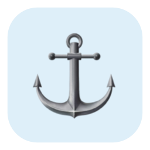

<p align="center">
  <a href="https://shihyuho.github.io/berth/">
    
  </a>
</p>

<h1 align="center">Berth</h1>

<p align="center"><strong>Keep your Dock where it belongs.</strong></p>

<p align="center">
  <b>English</b> ·
  <a href="README.zh-TW.md">繁體中文</a>
</p>

<p align="center">
  <a href="https://shihyuho.github.io/berth/"></a>
  <a href="https://github.com/shihyuho/berth/releases/latest"></a>
  
  <a href="LICENSE"></a>
</p>

On a multi-display Mac, the Dock can follow the pointer to a screen where you do not want it. Berth is a small menu bar app that gives the Dock a chosen berth and keeps it there.

It does not change your Dock preferences or block the pointer from crossing between displays. Choose a screen once, then let Berth quietly handle the rest.

## Why Berth?

- **Choose the Dock's display** from a simple menu bar menu.
- **Bring it back automatically** when macOS moves it elsewhere.
- **Keep pointer movement natural** across shared display edges.
- **Match your setup** with bottom, left, and right Dock positions.
- **Stay private by design** with no keyboard monitoring, analytics, or saved input; optional update checks contact only GitHub Releases.
- **Start with your Mac** through the built-in Launch at Login option.

## Get started

### Direct download

Download [Berth for Apple Silicon](https://github.com/shihyuho/berth/releases/latest/download/Berth-arm64.zip), unzip it, and move `Berth.app` to Applications.

### Homebrew

```sh
brew tap shihyuho/tap
brew install --cask shihyuho/tap/berth
```

### After installation

Open Berth, select the anchor in the menu bar, choose a display, and grant Accessibility access when macOS asks. See [Getting started](docs/getting-started.md) for first-launch and update details.

Berth requires macOS 13 or later on Apple Silicon.

## Learn more

| Guide | What it covers |
| --- | --- |
| [Getting started](docs/getting-started.md) | Installation, Gatekeeper, Accessibility permission, and updates |
| [How Berth works](docs/how-it-works.md) | Dock behavior, display changes, and privacy boundaries |
| [Troubleshooting](docs/troubleshooting.md) | Common setup and permission problems |
| [Development](docs/development.md) | Building from source, versions, and release packaging |
| [Testing](docs/testing.md) | Automated validation, coverage policy, and release smoke test |

## License

[MIT](LICENSE) © Shihyu
